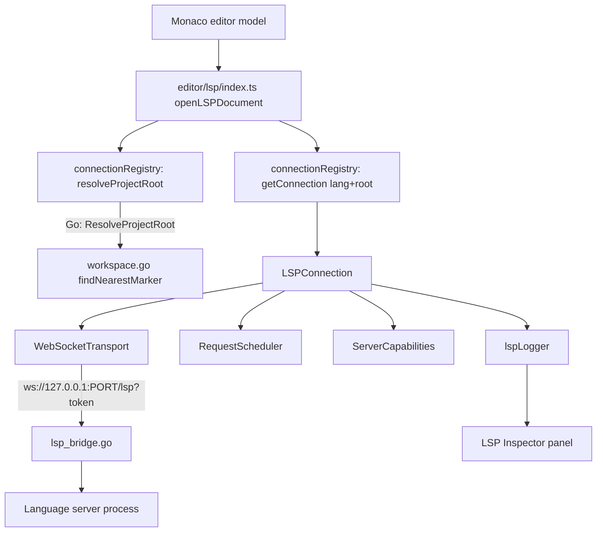

# LSP Architecture

How MervCode talks to language servers, end to end: workspace resolution,
transport, connection lifecycle, document sync, providers, and the
developer-facing inspector. This is the subsystem behind Go, TypeScript/
JavaScript, Java and Kotlin support today.

## Overview



## Project root resolution (`workspace.go`)

Every file resolves its **own** nearest project root before a connection is
opened, instead of the whole app sharing one global "workspace root" (the
folder opened via *Open Folder*). `ResolveProjectRoot(lang, filePath,
fallbackRoot)` walks up from the file's directory looking for that
language's marker files (`toolchain.go`'s `Markers`, e.g. `package.json`
for TypeScript, `go.mod` for Go), stopping at `fallbackRoot` as a boundary
so an unrelated marker higher up the filesystem is never mistaken for the
project root. Results are cached per `(lang, directory)`.

This is what makes multi-root workspaces work with zero explicit
configuration: a monorepo with `backend/go.mod` and `frontend/package.json`
opened as one folder gets two language servers, each rooted at its own
subdirectory - not both rooted at the repo root (which is why
`node_modules` resolution used to fail for anything but a single-package
repo).

`InvalidateWorkspaceCache()` clears the cache (call after operations that
create/remove marker files, e.g. `npm init`, checking out a branch).

## Transport (`lsp_bridge.go` + `editor/lsp/transport.ts`)

Monaco can't speak stdio, and language servers only speak LSP's
`Content-Length`-framed protocol over stdio. `lsp_bridge.go` is the
translation layer: a loopback-only WebSocket server (spun up lazily on
first use) that, per connection, spawns the requested language's server
process (looked up from `toolchain.go`) with its working directory set to
the resolved project root, and shuttles bytes in both directions,
converting framing.

Each server process is tracked as an `LSPServerInfo` (id, lang, root,
command, pid, status) and its lifecycle is published as Wails events
(`lsp:serverStarted`, `lsp:serverStopped`, `lsp:serverLog`) - this is the
backend half of the LSP Inspector's "Running LSPs" and "Logs" views. The
frontend's `WebSocketTransport` only knows `{send, onMessage, onClose,
close}` - it has no LSP-specific knowledge, which is what would let an
alternate transport (raw TCP to a remote `clangd`, attaching to an
already-running server, etc.) be added later without touching
`connection.ts`.

## Connection lifecycle (`editor/lsp/connection.ts`)

One `LSPConnection` per `(language, resolved root)`, cached in
`connectionRegistry.ts` and shared by every open file in that project
(matching how a real server process is shared). It owns:

- **Capability negotiation** (`capabilities.ts`): the `initialize`
  response's `ServerCapabilities` are parsed once and exposed as simple
  booleans (`hover`, `completion`, `definition`, `references`,
  `completionResolve`, `syncKind`). Providers check these before ever
  sending a request, instead of registering blindly and hoping.
- **Document sync** (`documentSync.ts`): Monaco's `onDidChangeModelContent`
  already reports exact edit ranges in an order safe to apply
  sequentially - that's mapped directly to LSP's incremental
  `TextDocumentContentChangeEvent[]` (no diffing needed). Falls back to
  whole-document sync automatically if the server only declared
  `TextDocumentSyncKind.Full`.
- **Request scheduling** (`requestScheduler.ts`): outgoing requests are
  ordered by priority (`interactive` > `navigation` > `bulk`) and capped at
  6 concurrent per connection, so a burst of formatting/workspace-symbol
  requests can never starve hover/completion, and a flood-prone server
  never gets more than a handful of requests at once.
- **Cancellation**: every `requestCancellable()` call returns a `cancel()`
  handle. Monaco's `CancellationToken` is wired to it directly, and
  same-kind requests against the same document (`supersedeKey`, e.g.
  `hover:<uri>`) automatically cancel their predecessor - this is what
  stops a slow hover response from a previous keystroke overwriting a
  newer one. Cancelling a request that's still queued (not yet dispatched)
  removes it from the scheduler for free; an in-flight one gets a real
  `$/cancelRequest` notification.
- **Crash recovery**: an unexpected socket close triggers a
  backoff-reconnect (`500ms * 2^attempt`, capped at 30s) that
  re-initializes and replays `didOpen` for every currently-open document.
  After 5 consecutive failures the connection marks itself `disabled` and
  stops retrying automatically - visible (and manually restartable) from
  the LSP Inspector's Servers tab.

## Dev Tools / LSP Inspector

`editor/lsp/logger.ts` is a dependency-free, ring-buffered log
(`lspLogger`) that every connection reports to: every request (with
timing and status), every notification (in/out), every server stderr
line, and every lifecycle event (connecting/ready/crashed/disabled).
`components/editor/LspInspector.tsx` is the panel that reads it, plus
polls `ListLSPServers()` (Go process view) and `connectionRegistry`'s
snapshots (protocol view) while open.

Open it via the Command Palette (**Developer: Toggle LSP Inspector**) or
`Ctrl+Shift+L`. Sections: Running LSPs, Open Documents, Capabilities,
Requests (master-detail, full request/response JSON), Notifications,
Diagnostics, Performance (per-method latency/error/cancel counts), Logs.

## Module map

```
frontend/src/editor/lsp/
├── protocol.ts          JSON-RPC / LSP wire types
├── uri.ts                path <-> file:// URI helpers
├── logger.ts             Dev Tools / LSP Inspector event log
├── requestScheduler.ts   priority + concurrency-limited request queue
├── capabilities.ts       normalized ServerCapabilities
├── transport.ts          WebSocket wire I/O
├── connection.ts         per (language, root) orchestrator + crash recovery
├── documentSync.ts       Monaco model changes -> LSP didChange deltas
├── providers.ts          Monaco hover/completion/definition/reference providers
├── diagnostics.ts        LSP Diagnostic -> Monaco marker mapping
├── connectionRegistry.ts connection cache + project root resolution
└── index.ts              public entry point (openLSPDocument)
```

`index.ts` is the only file language modules under
`editor/monaco/languages/*.ts` import from - everything else is an
internal implementation detail. Adding a new language still only requires
following the steps in the top-level `AGENTS.md`; nothing above changes.

## Language profiles (`toolchain.go`)

`LSPConfig` carries optional `InitializationOptions` and `Env`, exposed to
the frontend via `GetLanguageProfile(lang)` and merged into the
`initialize` request's `initializationOptions`. Adding a language-specific
setting (e.g. `rust-analyzer`'s `cargo`/`checkOnSave` config) is a
`toolchain.go` edit, not a TypeScript one.

## What's intentionally not built yet

Kept out of this pass to avoid piling abstraction on top of a subsystem
that needed to be correct first - see `FeatureMatrix.md` for the full
picture:

- A generic **Transport** abstraction beyond stdio-over-WebSocket (TCP,
  named pipes, remote/SSH) - the seam exists (`Transport` interface) but
  only `WebSocketTransport` is implemented.
- A **Plugin API** (`registerLanguage`/`registerCommand`/etc.) - languages
  are still registered by editing `toolchain.go` + `registry.ts` per the
  existing convention.
- A workspace-wide **file/symbol index** for fast `Ctrl+P`/`Ctrl+T`.
- A cross-cutting **background job manager** unifying indexing/git/search/
  LSP/formatting under one scheduler - the new `RequestScheduler` only
  covers LSP requests.
- A **file cache** layer between disk and Monaco/LSP.
- **Mock LSP servers** for testing the client without installing real
  toolchains.
- **Session persistence** beyond the existing tabs/active file/root path
  (cursor, scroll, folding, splits, terminal, recent projects).
