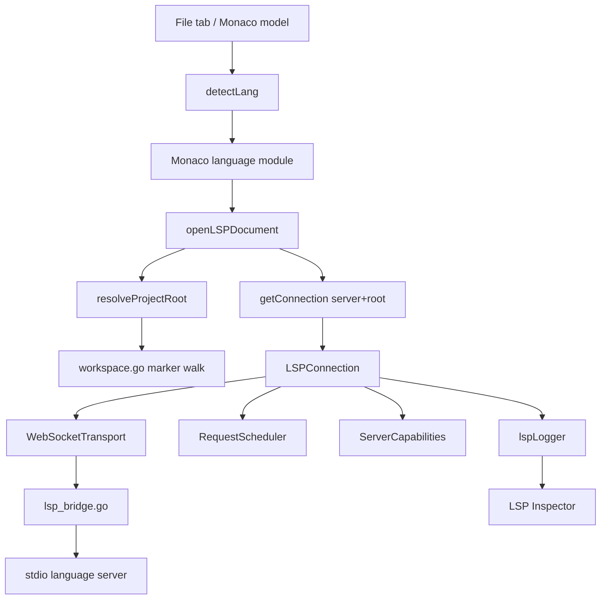

# LSP Architecture

How MervCode talks to language servers end to end: language detection, workspace resolution, transport, connection lifecycle, active-tab document sync, providers, logging, and the developer-facing inspector.

## Overview

## Language identity

Monaco language IDs and backend toolchain IDs are related but not always identical.

The TypeScript family keeps four Monaco IDs:

- `typescript`
- `typescriptreact`
- `javascript`
- `javascriptreact`

All four map to backend toolchain `typescript`. This allows Monaco grammar/tokenization and LSP `didOpen.languageId` to stay concrete while using the same backend LSP/formatter/linter tools.

Mapping files:

- `frontend/src/editor/detectLang.ts`
- `frontend/src/editor/languageIds.ts`
- backend `canonicalToolchainLang()` in `toolchain.go`

## Active-tab LSP lifecycle

MervCode renders hidden editor tabs to preserve state, but LSP/lint features attach only for the active tab. This prevents background tabs from starting duplicate language servers or opening duplicate documents.

Lifecycle in `frontend/src/pages/Editor.tsx`:

1. Monaco model is created/reused for every tab.
2. If the tab is inactive, LSP/lint features are suspended.
3. When the tab becomes active, `applyLanguageFeatures()` wires LSP/lint/formatter for that model.
4. When the tab becomes inactive or changes root/language, cleanup closes the LSP document and clears lint markers.
5. Connections remain cached per `(language, root)` and can be reused by later active files.

This is especially important for Java/Kotlin because JDTLS and JetBrains Kotlin LSP use workspace data paths that cannot safely be opened by multiple duplicate server processes.

## Project root resolution (`workspace.go`)

`ResolveProjectRoot(lang, filePath, fallbackRoot)` walks up from the file directory looking for marker files configured in `toolchain.go`.

Examples:

- Go: `go.mod`
- TypeScript: `package.json`, `tsconfig.json`, `jsconfig.json`
- Java/Kotlin: Gradle/Maven/KPM marker files

The result becomes the language server process working directory and LSP `rootUri`/`workspaceFolders` root.

## Transport (`lsp_bridge.go` + `transport.ts`)

The frontend sends JSON-RPC text frames through a local loopback WebSocket. The Go bridge converts WebSocket messages to LSP `Content-Length` stdio frames, spawns the language server, and forwards server responses back to the browser.

Key properties:

- Loopback-only WebSocket server.
- One-shot random token per session.
- Per-session server process tracking.
- Structured server lifecycle events:
  - `lsp:serverStarted`
  - `lsp:serverStopped`
  - `lsp:serverLog`
- Full request/notification/response logging with document text summarized.

## Connection lifecycle (`connection.ts`)

`LSPConnection` owns:

- WebSocket connection lifecycle.
- `initialize`/`initialized` handshake.
- Capability parsing.
- Request IDs and pending responses.
- Request scheduling and cancellation.
- Document open/change/close.
- Diagnostics fanout.
- Crash/reconnect handling.

One connection is cached per `(server language, root)` by `connectionRegistry.ts`.

## Request scheduling and cancellation

`RequestScheduler` prioritizes interactive requests over bulk work and caps concurrent requests. Hover and completion are cancellable and supersede older requests for the same URI.

Expected cancellation responses such as LSP `-32800 cancelled` are normal during mouse movement/typing and are logged at debug level when stale.

## Providers (`providers.ts`)

Monaco providers are registered once per Monaco language ID. They do not close over a single connection. Instead, each provider call looks up the document URI's current connection.

Supported providers today:

- Hover
- Completion
- Definition
- References
- Diagnostics via `publishDiagnostics`

## Document sync (`documentSync.ts`)

Monaco emits exact edit ranges. These are converted to LSP incremental `TextDocumentContentChangeEvent` values when supported, otherwise full-document sync is used.

Document sync logs include didOpen/didChange/didClose details and the owning connection id.

## Language profiles

`GetLanguageProfile(lang)` exposes backend LSP profile data to the frontend:

- markers
- initialization options

TypeScript uses this to provide a fallback `tsserver.path` for JS/JSX projects that do not install TypeScript locally.

## Inspector

The LSP Inspector (`Ctrl+Shift+L`) shows:

- Running LSP server processes.
- Open documents.
- Capabilities.
- Requests and responses.
- Notifications.
- Diagnostics.
- Performance stats.
- Server logs.

## Logging tags

| Prefix | Meaning |
| --- | --- |
| `[lsp]` | Connection lifecycle. |
| `[lsp ↑]` | Frontend to bridge/server JSON-RPC. |
| `[lsp ↓]` | Server/bridge to frontend JSON-RPC. |
| `[lsp-sync]` | Document sync lifecycle. |
| `[lint]` | Linter runner. |
| `[monaco]` | Editor/model lifecycle. |
| `[backend]` | Wails backend call tracing or Go logs. |

## Known limitations

See `FeatureMatrix.md` for the roadmap. Notable missing pieces:

- Completion resolve.
- Signature help.
- Rename/code actions/workspace edits.
- LSP semantic token application.
- Document/workspace symbols.
- Dynamic capability registration.
- Progress UI.
