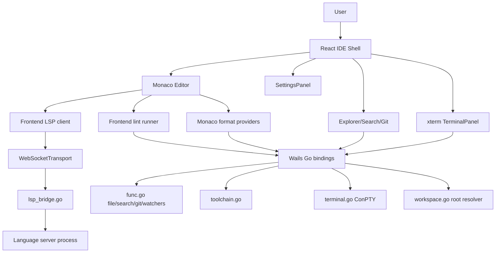

# MervCode Project Overview

MervCode is a native desktop IDE built with Wails v2. The backend is Go and owns native capabilities such as filesystem access, Git commands, file watching, ConPTY terminals, toolchain execution, and LSP process management. The frontend is React/TypeScript and owns the IDE shell, Monaco editor, tabs, settings, LSP client, lint runner, and terminal UI.

## Goals

- Provide a fast desktop-first coding environment.
- Keep familiar IDE conventions from VS Code/Sublime/Atom.
- Support multiple language ecosystems through a central toolchain registry.
- Keep language servers/processes isolated by project root.
- Make debugging protocol/tooling issues transparent through structured logs and the LSP Inspector.

## High-level architecture

## Backend responsibilities

| File | Responsibility |
| --- | --- |
| `main.go` | Wails application setup and lifecycle hooks. |
| `func.go` | File operations, read/write, search, Git helpers, file watchers. |
| `workspace.go` | Resolves a file's nearest project root based on toolchain marker files. |
| `toolchain.go` | Central registry for languages, LSPs, formatters, linters, markers, installers. |
| `toolchain_manager.go` | Tool availability checks and install helpers. |
| `lsp_bridge.go` | Local WebSocket server that bridges JSON-RPC frames to stdio LSP servers. |
| `terminal.go` | Integrated terminal sessions using Windows ConPTY. |
| `typescript_lsp.go` | TypeScript `tsserver.js` fallback path for JS/JSX projects without local TypeScript. |
| `jdtls.go` | Bundled Java/JDTLS resolution and launch helpers. |
| `kotlin.go` | Bundled JetBrains Kotlin LSP resolution and launch helpers. |
| `eslint.go`, `golangci-lint.go`, `checkstyle.go`, `ktlint.go` | Linter argument/parsing integrations. |
| `google_java_format.go`, `ktfmt.go` | Formatter integrations. |

## Frontend responsibilities

| Path | Responsibility |
| --- | --- |
| `frontend/src/pages/Home.tsx` | Main IDE shell, layout state, settings hook, workspace/tabs composition. |
| `frontend/src/pages/Editor.tsx` | Monaco editor lifecycle, active-tab LSP/lint/format feature attachment. |
| `frontend/src/components/editor/` | Header, sidebar, explorer, search, git, tabs, settings, terminal, inspector. |
| `frontend/src/hooks/` | Reusable state hooks such as tabs, file operations, editor settings. |
| `frontend/src/editor/detectLang.ts` | File name/extension to Monaco language ID. |
| `frontend/src/editor/languageIds.ts` | Concrete Monaco language IDs to backend toolchain IDs. |
| `frontend/src/editor/monaco/` | Monaco setup, registry, language modules, option mapping. |
| `frontend/src/editor/lsp/` | LSP protocol client, transport, provider registration, diagnostics, logs. |
| `frontend/src/editor/lint/` | Generic debounce/run/map flow for external linters. |
| `frontend/src/lib/persistence.ts` | Workspace state persistence helpers. |
| `frontend/src/lib/backendLog.ts` | Wails binding tracing for debugging frontend-to-Go calls. |

## IDE shell and tab model

`Home.tsx` composes the app shell:

- Header/menu/command palette.
- Sidebar with explorer/search/git/settings/dev tools panels.
- Editor area with tab bar, editor host, and terminal.
- Status bar.

Open files are represented as `FileTab` objects. Text file content is kept in React state for dirty tracking and persisted workspace restore. Monaco models are created per file URI in `Editor.tsx`.

Important rule: LSP/lint features attach only to the **active** editor tab. Hidden tabs keep their Monaco model but do not spawn duplicate LSP documents or language servers. This is critical for Java/Kotlin, whose servers use project-specific workspace data directories that cannot be shared by multiple processes.

## Workspace roots

MervCode distinguishes the opened folder from language project roots. `workspace.go` resolves each file's nearest language root by walking up from the file directory looking for marker files declared in `toolchain.go`.

Examples:

- Go: `go.mod`
- TypeScript family: `package.json`, `tsconfig.json`, `jsconfig.json`
- Java/Kotlin: `pom.xml`, `build.gradle`, `build.gradle.kts`, `settings.gradle`, `kpm.json`, etc.

This allows a single opened folder to contain multiple language projects with separate LSP connections.

## Toolchain model

All language tools are registered in `toolchain.go` as `LanguageToolchain` objects:

- `ID`, `Name`
- `LSP`
- `Formatter`
- `Linter`
- project `Markers`
- runtime binary and install URL
- automatic installers and manual hints

Formatter and linter execution is centralized in `FormatDocument` and `LintDocument`. Individual linter output formats are parsed by small focused files like `eslint.go`, `checkstyle.go`, and `ktlint.go`.

## TypeScript family model

Monaco requires concrete language IDs:

- `typescript`
- `typescriptreact`
- `javascript`
- `javascriptreact`

The backend intentionally has one shared `typescript` toolchain because all four use `typescript-language-server`, Prettier, and ESLint. `frontend/src/editor/languageIds.ts` and backend `canonicalToolchainLang()` keep this mapping consistent.

## LSP model

The frontend has one `LSPConnection` per `(server/toolchain language, resolved project root)`. The Go backend starts one language server process per WebSocket session. The frontend caches connections and routes Monaco providers through the correct document connection.

Detailed protocol docs are in [`LSP-Architecture.md`](LSP-Architecture.md).

## Settings model

Settings are stored under `localStorage["mervcode:editorSettings"]`. They deep-merge with defaults so new settings safely appear for existing users.

Settings flow:

1. Interface: `frontend/src/types.ts`
2. Defaults/load/save/reset: `frontend/src/hooks/useEditorSettings.ts`
3. UI schema: `frontend/src/editor/settingsSchema.ts`
4. Panel renderer: `frontend/src/components/editor/SettingsPanel.tsx`
5. Monaco mapping: `frontend/src/editor/monaco/toMonacoOptions.ts`
6. Terminal/editor behavior consumers: `Editor.tsx`, `EditorArea.tsx`, `TerminalPanel.tsx`

Editor settings and terminal settings are kept isolated.

## Terminal model

The backend uses ConPTY (`terminal.go`). The frontend uses xterm (`TerminalPanel.tsx`). Terminal sessions are keyed by tab id.

Exit flow:

1. Backend waits for the ConPTY process with `Wait`.
2. Backend emits `terminal:exit:<id>` with `{ exitCode, ok, error? }`.
3. Frontend marks the tab as exited and stops sending input to it.
4. Backend treats input after exit as a no-op to avoid noisy race errors.

## Logging and diagnostics

MervCode intentionally logs LSP and backend transactions in detail:

- `[backend]` / `[backend ←]` / `[backend →]`: Wails binding tracing.
- `[lsp]`: lifecycle.
- `[lsp ↑]`: frontend -> backend/server JSON-RPC frame.
- `[lsp ↓]`: server/backend -> frontend JSON-RPC frame.
- `[lsp-sync]`: didOpen/didChange/didClose wiring.
- `[lint]`: linter requests/responses.
- `[monaco]`: editor lifecycle and model changes.

The LSP Inspector shows a structured in-app view of these details.

## Runtime directories

Bundled language tooling is resolved from `runtime/` where applicable:

- Java/JDTLS under `runtime/java`.
- Kotlin LSP/runtime/tooling under `runtime/kotlin`.

The helper files avoid hardcoded machine-local paths and resolve production/source-tree layouts.
