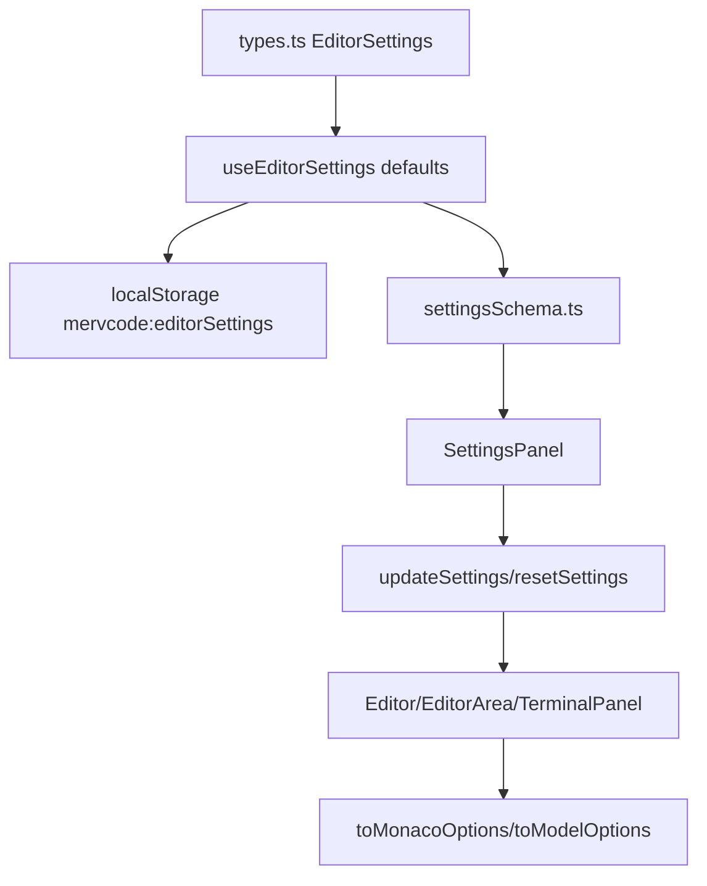
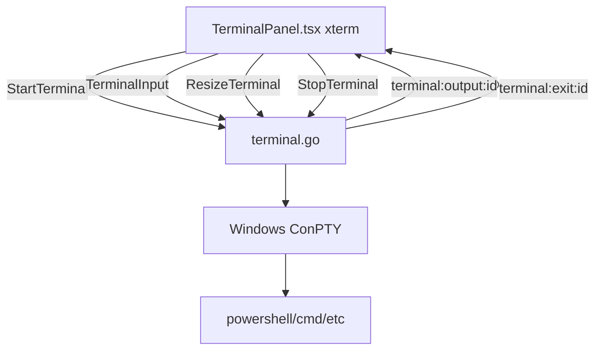

# Settings and Terminal

This document covers editor/terminal settings and integrated terminal behavior.

## Settings architecture

Settings are represented by the `EditorSettings` interface in `frontend/src/types.ts`. Despite the name, it currently includes both editor settings and terminal settings. Terminal settings are kept in separate fields and consumed only by `TerminalPanel`.

Settings flow:



## Storage

Settings are stored in:

```text
localStorage["mervcode:editorSettings"]
```

`useEditorSettings.ts` deep-merges saved values with defaults. This is important because nested settings such as `minimap`, `scrollbar`, `hover`, `inlayHints`, and terminal settings can gain new fields over time without breaking existing users.

## Reset defaults

The Settings panel exposes a **Reset Defaults** button. It resets editor and terminal settings to `defaultEditorSettings`.

## Adding a setting

1. Add the field to `EditorSettings` in `frontend/src/types.ts`.
2. Add a default to `defaultEditorSettings` in `frontend/src/hooks/useEditorSettings.ts`.
3. Add a UI field in `frontend/src/editor/settingsSchema.ts`.
4. Consume the setting in one of:
   - `frontend/src/editor/monaco/toMonacoOptions.ts`
   - `frontend/src/editor/monaco/toMonacoOptions.ts` `toModelOptions`
   - `frontend/src/pages/Editor.tsx`
   - `frontend/src/components/editor/EditorArea.tsx`
   - `frontend/src/components/editor/TerminalPanel.tsx`
5. Validate that changing the setting has an effect and does not affect unrelated UI.

## Editor settings

Major setting groups:

- Font and ligatures
- Indentation
- Wrapping
- Line numbers/highlight
- Minimap
- Scrollbar and overview ruler
- Folding/glyph margin
- Whitespace/rendering guides
- Bracket pair colorization
- Sticky scroll
- Cursor and selection
- Multi-cursor
- Suggestions/snippets/hover/parameter hints
- Saving and formatting
- Auto-closing/indent
- Scrolling/padding
- Unicode/highlighting/inlay hints
- Performance/large file behavior

`toMonacoOptions.ts` maps editor settings to Monaco `IEditorOptions` / `IGlobalEditorOptions`. `toModelOptions` maps model-level settings such as tab size and insert spaces.

## Auto-save behavior

Supported values:

- `off`
- `afterDelay`
- `onFocusChange`
- `onWindowChange`

`afterDelay` uses `autoSaveDelay`. `formatOnSave` is applied before save when enabled. Auto-save modes are implemented in `Editor.tsx` and should not affect terminal or app-global UI.

## Terminal settings

Terminal settings are separate from Monaco editor settings:

- `defaultShell`
- `terminalFontFamily`
- `terminalFontSize`
- `terminalCursorBlink`
- `terminalScrollback`
- `terminalHeight`

They are passed from `EditorArea.tsx` into `TerminalPanel.tsx` and used by xterm. Existing terminal tabs update font/cursor/scrollback options where xterm supports it. New tabs use the current `defaultShell`.

## Integrated terminal architecture



## Terminal lifecycle

- `StartTerminal(id, shell)` starts a ConPTY session.
- Output is streamed through `terminal:output:<id>` events.
- Backend waits for process exit and emits `terminal:exit:<id>` with:

```ts
{
  exitCode: number;
  ok: boolean;
  error?: string;
}
```

- Frontend marks the tab as exited and stops sending input to that session.
- Post-exit input is a no-op in the backend to avoid noisy races.
- Closing a terminal tab calls `StopTerminal(id)` and disposes xterm resources.

## Ctrl+C behavior

Ctrl+C is sent as normal terminal input through xterm to ConPTY. If the foreground command exits with a non-zero code after interruption, the terminal displays that exit code. The important behavior is that the tab no longer hangs: backend `Wait` emits the exit event and closes PTY handles so output reads unblock.

## Do not mix editor and terminal settings

Editor font settings should not automatically change terminal font settings. Terminal settings should not change Monaco options. Keep this separation when adding new settings.
